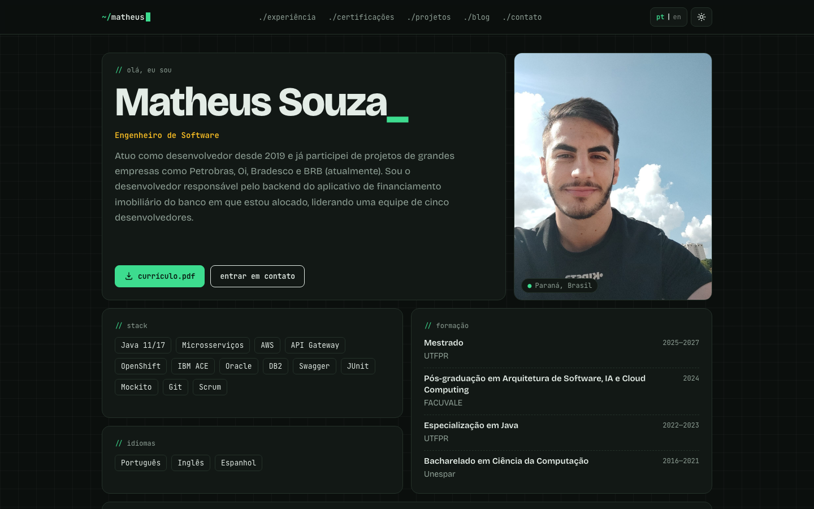
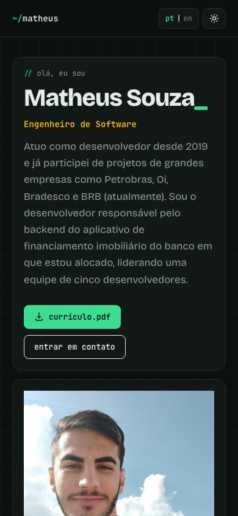

# Portfólio pessoal


Portfólio de Matheus Souza, Engenheiro de Software — **https://matheuscs787.github.io**

Site estático, responsivo, feito com HTML, CSS e JavaScript puros (sem build), publicado no GitHub Pages.

## Funcionalidades

- **Português e inglês** — o idioma inicial segue o navegador; o botão `pt | en` troca e a escolha fica salva. Links com `?lang=en` ou `?lang=pt` abrem direto no idioma.
- **Tema claro e escuro** — o tema inicial segue o sistema; o botão troca e a escolha fica salva.
- Seções de experiência (com tempo em cada empresa calculado automaticamente), certificações, blog e contato.

## Demo




## Estrutura

```
index.html                 página principal
tcc.html                   página do TCC (linkada na formação)
assets/css/style.css       estilos e tokens de tema (claro/escuro)
assets/js/prefs.js         aplica tema e idioma antes da renderização
assets/js/script.js        botões de tema/idioma e duração das experiências
assets/images/             foto de perfil e imagens do TCC
assets/pdf/                currículo e TCC
```

### Editando textos

Cada texto traduzível existe em dois elementos lado a lado, um para cada idioma. O CSS mostra apenas o do idioma ativo:

```html
<p lang="pt-BR">Texto em português</p>
<p lang="en">Text in English</p>
```

Ao alterar ou adicionar conteúdo, mantenha sempre o par `pt-BR` / `en`.

## Rodando localmente

Qualquer servidor estático funciona, por exemplo:

```bash
python3 -m http.server 8000
```

E acesse `http://localhost:8000`.

## Licença

Esse projeto é **livre para uso** e não tem nenhuma licença.
A primeira versão foi baseada no template [vCard](https://github.com/codewithsadee/vcard-personal-portfolio).
